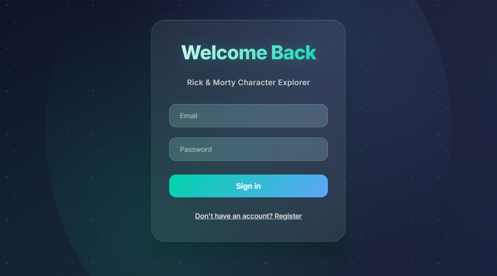

# Rick and Morty Character Explorer 🛸

A full-stack web appl## 🏗️ What's Inside

- **Frontend**: React wit## 🏗️ What's Inside
## 🏗️ What's Inside

- **Frontend**: React with TypeScript (Port 3000)
- **Backend**: Node.js API with authentication (Port 3001)
- **Database**: PostgreSQL for user data
- **Cache**: Redis for fast character loading
- **Testing**: Jest unit & integration tests with clean architecture focus
- **Architecture**: Domain-Driven Design with separation of concerns

## 🛑 Stopping the Applicationntend**: React with TypeScript (Port 3000)
- **Backend**: Node.js API with authentication (Port 3001)
- **Database**: PostgreSQL for user data
- **Cache**: Redis for fast character loading
- **Testing**: Jest unit tests with clean architecture focus
- **Architecture**: Domain-Driven Design with separation of concerns

## 🛑 Stopping the Applicationript (Port 3000)
- **Backend**: Node.js API with authentication (Port 3001)
- **Database**: PostgreSQL for user data
- **Cache**: Redis for fast character loading
- **Testing**: Jest unit tests for reliability

## 🧪 Testing

The backend includes comprehensive testing at multiple levels following clean architecture principles:

### Test Types

#### 🔬 Unit Tests (Domain Layer)
- **Character Model**: Tests immutability, API data transformation, and serialization
- **Edge Cases**: Handles missing or null fields from external APIs  
- **Factory Methods**: Validates `fromApiResponse` data transformations
- **JSON Serialization**: Ensures proper `toJSON()` output for frontend communication

#### 🔗 Integration Tests (Authentication)
- **User Registration**: Valid data acceptance, duplicate user rejection, invalid data handling
- **User Login**: Credential validation, token generation, error scenarios

### Running Tests

```bash
# Run all tests (unit + integration)
docker exec api npm run test:all

# Run only domain unit tests  
docker exec api npm run test:domain

# Run only integration tests
docker exec api npm run test:integration


### Test Structure
```
api/src/test/
├── domain/
│   └── Character.unit.test.ts       # Character domain model tests
├── integration/
│   └── Auth.integration.test.ts     # Authentication flow tests
└── mocks/
    └── characterMocks.ts            # Centralized test data
```

The tests focus on **behavior over implementation**, avoiding trivial getter tests and emphasizing business logic validation with real HTTP requests for integration scenarios.


## 🛑 Stopping the Applicationto explore and save your favorite characters from the Rick and Morty universe!



## ✨ Features

- **Browse Characters**: Explore all Rick and Morty characters with their details
- **Favorites System**: Save and manage your favorite characters
- **User Authentication**: Secure login and registration
- **Fast Performance**: Redis caching for lightning-fast loading
- **Responsive Design**: Works perfectly on desktop and mobile

## 🚀 Quick Start

### Prerequisites
- Docker
- Docker Compose

### Running the Application

1. **Clone the repository**:
   ```bash
   # HTTPS
   git clone https://github.com/Mortyrise/Im-a-pickle.git
   # or SSH
   git clone git@github.com:Mortyrise/Im-a-pickle.git
   cd RickAndMortyRepo

2. **Start the application**:
   ```bash
   docker compose up -d
   ```

3. **Open your browser** and go to: `http://localhost:3000`

4. **Create an account** or login with existing credentials

5. **Start exploring!** Browse characters and add your favorites 🎉

## 📚 API Documentation

The API comes with interactive Swagger documentation! After starting the application:

- **Swagger UI**: `http://localhost:3001/api-docs`

Here you can:
- 🔍 Explore all available endpoints
- 🧪 Test API calls directly from the browser
- 📖 View request/response schemas
- 🔐 Test authentication endpoints

## 🎮 How to Use

1. **Register/Login**: Create an account or sign in
2. **Browse Characters**: Scroll through the character list
3. **Add Favorites**: Click the portal button (⭕) to save favorites
4. **Filter**: Toggle between "Show All" and "Show Favorites"
5. **View Details**: Click on any character for more information

## 🏗️ What's Inside

- **Frontend**: React with TypeScript (Port 3000)
- **Backend**: Node.js API with authentication (Port 3001)
- **Database**: PostgreSQL for user data
- **Cache**: Redis for fast character loading

## � Stopping the Application

```bash
docker compose down
```

## 🐛 Troubleshooting

If something doesn't work:

1. Make sure ports 3000 and 3001 are available
2. Wait a few seconds for all services to start
3. Check logs: `docker compose logs`
4. Restart: `docker compose restart`

---

**Enjoy exploring the Rick and Morty universe! 🚀✨**
